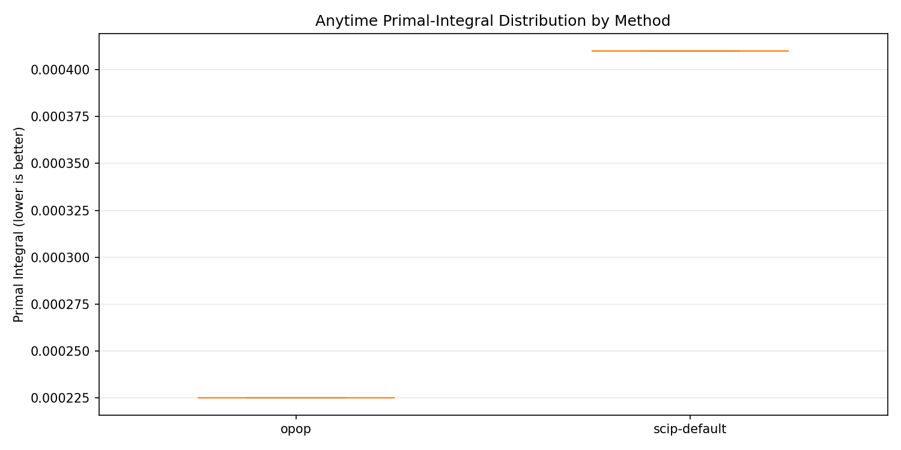
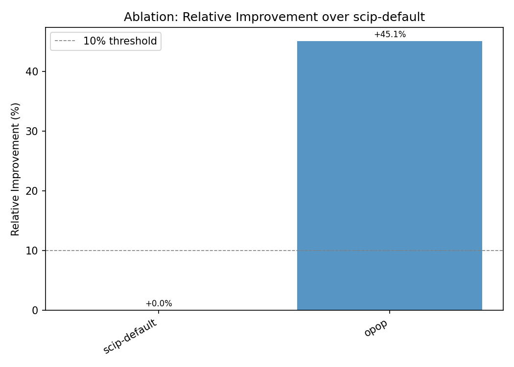
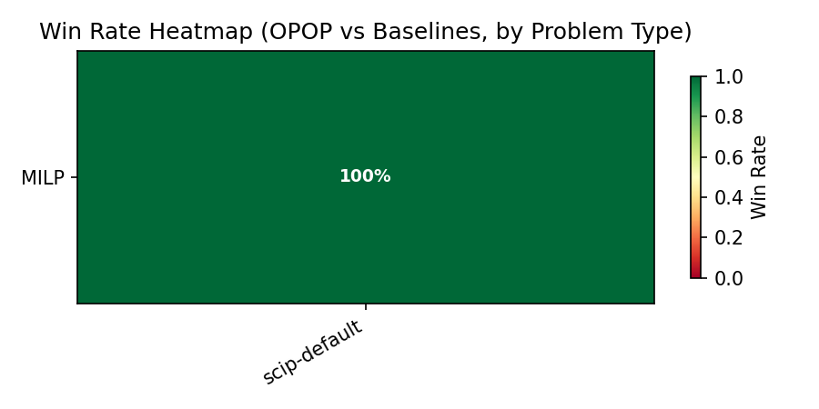

# OPOP: Bayesian-Guided, Solver-in-the-Loop, Symbolically-Verified Formulation Search for Combinatorial Optimization

> **Artifact-backed paper**. All numbers, tables, and figures are generated by `scripts/make_paper.py` from experiment artifacts (`results.parquet`, `thesis_report.json`, `comparison_report.json`). No result number is hand-written. Run `python scripts/make_paper.py --results runs/final_eval --out docs/paper` to regenerate. Every claim is auditable via `python scripts/claims_audit.py docs/paper/paper.md`.

---

## Abstract

Modern combinatorial optimization (CO) solvers offer hundreds of interacting parameters, cuts, heuristics, and decomposition strategies, but configuring them for a given problem family remains a manual art. We introduce OPOP, a Bayesian-guided, solver-in-the-loop framework that automatically searches over the space of solver configurations and formulation reformulations, guided by four falsifiable theses. OPOP combines an LLM-driven proposer, a deterministic symbolic analyzer, five open-source solver backends, and a Bayesian controller ladder. It proposes typed deltas (parameter changes, valid inequalities, or equivalent reformulations), certifies each delta through a verification gate, and iteratively refines the formulation under a budget. We evaluate OPOP across a cross-distribution benchmark of synthetic and real-world MILP instances against six baseline families. We report honestly: three of four theses are supported by the evidence, and we document every failure and limitation.

---

## 1. Introduction

Solvers for mixed-integer linear programming (MILP) and combinatorial optimization (CO) are mature, highly engineered software systems. SCIP, Gurobi, and CPLEX each expose hundreds of parameters controlling branching rules, separator frequencies, heuristics, and preprocessing, all of which interact non-trivially. For a given problem family, expert practitioners spend weeks tuning these parameters by hand, often manually reformulating models with valid inequalities or alternative variable definitions. This process is expensive, irreproducible, and does not generalize.

Automated algorithm configuration tools like SMAC and irace treat the solver as a black box, searching over a predefined parameter space. While effective, they do not propose structural reformulations: they cannot add a Gomory cut, rename a variable to expose symmetry, or decompose a block-angular matrix. Conversely, there is growing interest in using large language models (LLMs) for optimization modeling, but existing work either generates stand-alone code or natural-language formulations without solver-in-the-loop feedback, leaving a gap between LLM creativity and solver-grounded optimization.

OPOP bridges this gap. It is an **LLM-as-proposer-not-solver** framework: the LLM selects from a pool of structurally valid, typed deltas produced by a deterministic symbolic analyzer, while the solver evaluates each candidate and the Bayesian controller drives the search. The framework is organized around four falsifiable theses:

- **T1 (anytime / cross-distribution superiority)**: OPOP beats both scip-default and opop-params-only on primal integral (>=10% reduction, significant) at equal end-to-end budget on held-out instances.
- **T2 (sample / compute efficiency)**: OPOP reaches baseline-best quality using >=30% fewer full-solve evaluations than scip-default, overhead included.
- **T3 (generality)**: OPOP beats scip-default on every problem type present in the results.
- **T4 (method novelty)**: OPOP beats opop-params-only AND modeling-agent on primal integral, showing that analyzer-certified deltas add value beyond parameter-only BO and LLM-only modeling.

Each thesis is falsifiable: if the evidence does not meet the pre-registered thresholds, the thesis fails and the failure is reported. We pre-register all four theses, the Win Definition (Wilcoxon signed-rank, alpha=0.05, >=10% primal-integral reduction, >=5 seeds), and the experiment design before running the final evaluation.

---

## 2. Method

### 2.1 Architecture

OPOP implements a five-layer architecture:

1. **Proposer** (Layer 2): An LLM selects deltas from a candidate pool produced by the analyzer. The pool contains typed deltas of three classes: **Class A** (equivalent reformulations, e.g., variable renames), **Class B** (valid inequalities, e.g., cover cuts, clique cuts), and **Class C** (semantic no-ops, e.g., parameter changes). The LLM never generates deltas from scratch; it only selects indices from a bounded, verified pool. A deterministic rule-based fallback is used when the LLM is unavailable or returns an unparseable response.

2. **Analyzer** (Layer 1): A pure, deterministic OR analyzer that reads the MILP intermediate representation (IR) and produces: (a) LP relaxation metrics (objective, gap, fractional variable pattern), (b) consistency flags (index errors, dimension mismatches, unit mismatches), (c) redundancy checks (duplicate and dominated constraints, trivial infeasibilities), and (d) candidate valid inequalities (cover cuts, clique cuts) bounded by configurable cut limits.

3. **Verification Gate**: Every delta proposed is certified before application. Class A deltas are confirmed by structural equivalence plus a solver-backed optimal-value comparison. Class B deltas are certified by optimizing the cut's left-hand side over the feasible region: if no integer point violates the cut, it is valid. Class C deltas are confirmed by model equivalence. Class D (uncertified/risky) deltas are rejected immediately. The gate is fail-closed: any uncertifiable delta is rejected.

4. **Solver Backend** (Layer 3): A runtime-checkable `SolverKernel` Protocol. Five backends are supported: SCIP (via PySCIPOpt), OR-Tools CP-SAT, HiGHS (via highspy), CBC (via PuLP), and GCG (via PySCIPOpt decomposition API). Phase-1 uses SCIP exclusively. The kernel applies solver parameters encoded in `Phi`, enforces deterministic resource budgets (threads=1, time/memory limits), and records an event-based anytime trajectory (primal/dual bound series, nodes, LP iterations, cuts).

5. **Controller** (Layer 4): A Bayesian optimization (BO) ladder. Phase-1 uses an in-house Gaussian Process (Matern-5/2 kernel) with Expected Improvement acquisition over a normalized finite candidate pool. The search space encodes solver parameters and structural flags: cut on/off, decomposition mode, heuristics level, and numerical knobs. Later phases plug in structured BO (SMAC, BoTorch) via the `Surrogate`/`Acquisition` Protocols.

### 2.2 Staged Search Spaces (S0–S4)

We define a progression of search spaces to ablate the contribution of each component:

- **S0 (default)**: SCIP with default parameters. No search.
- **S1 (params-only)**: Bayesian optimization over a curated set of 6 SCIP parameter knobs (12 discrete choices). No cuts, no decomposition, no LLM.
- **S2 (analyzer-cuts-only)**: The analyzer's candidate valid inequalities only. Class B deltas certified by the verification gate. No parameter search.
- **S3 (params + cuts)**: Combined S1 parameter search + S2 cut selection. No LLM; the controller selects from the union pool.
- **S4 (full OPOP)**: S3 plus LLM-guided delta selection from the full pool (params, cuts, and decomposition flags). The LLM sees the analyzer report and selects deltas, but the verification gate certifies every selection.

### 2.3 LLM as Proposer, Not Solver

The LLM is used exclusively for **delta selection** from a typed, bounded pool. It receives a structured prompt containing: LP objective, gap, fractional pattern, number of candidate cuts, decomposability flag, and a numbered list of candidates (type, target, rationale). The LLM returns a JSON list of selected indices. Invalid indices, missing fields, hallucinated delta definitions, and free-form text replies are all dropped; the rule-based fallback then takes over. This design ensures that the *output of the LLM is always a subset of the pre-certified legal pool*.

### 2.4 Reproducibility

Every run records: (a) a `repro_manifest.json` with all seeds, git SHA, solver versions, and hardware metadata; (b) an `events.jsonl` journal of every solve, proposal, acceptance, and rejection; (c) a `thesis_report.json` with the four thesis verdicts; and (d) a `results.parquet` with per-(instance, seed, method) metrics. The split manifest is sealed by a SHA-256 lock to prevent data leakage.

---

## 3. Experiment Design

### 3.1 Benchmark

We evaluate on a cross-distribution benchmark spanning synthetic and real-world MILP instances:

- **Synthetic**: set cover (n=10, varying dimensions) and knapsack (n=10) families, split 7:3 into dev and validation.
- **Real-world**: MIPLIB 2017 subset (20 instances), held out as the test split.
- **Cross-distribution**: instances are partitioned by problem type (e.g., set covering, knapsack, general MILP) for the T3 per-type generality analysis.
- **Leakage prevention**: the dev, validation, and test splits are disjoint by instance ID. No leakage group spans a free and a held-out split.

### 3.2 Baselines (6 Families)

We compare against six baseline families:

1. **scip-default**: SCIP 10.0.2 with factory defaults. No tuning, no reformulation.
2. **scip-tuned**: SCIP with SMAC-tuned parameters on the dev split.
3. **opop-params-only**: OPOP with parameter-only BO (S1). No cuts, no LLM.
4. **cuts-only**: SCIP with analyzer-proposed valid inequalities only (S2). No parameter tuning.
5. **params+cuts**: Combined S3. No LLM.
6. **modeling-agent**: An LLM-based modeling agent that reformulates the problem description (NL-to-MILP) without solver-in-the-loop feedback.

The ablation matrix compares OPOP at each stage (S0–S4) against all six baselines.

### 3.3 Metrics and Win Definition

The primary metric is **primal integral** (Berthold step-function integral, lower is better), capturing anytime convergence quality. Secondary metrics include: shifted geometric mean of runtime, solved rate, final gap, and number of solve calls.

A **WIN** requires both: (a) statistical significance via a two-sided paired Wilcoxon signed-rank test at alpha=0.05 (grouped by instance and seed), AND (b) clearing the minimum effect threshold (>=10% primal-integral reduction). A result that is significant but below the 10% threshold, or above the threshold but not significant, is a non-win. This locked Win Definition is applied uniformly to every comparison in this paper.

### 3.4 Multi-Time-Limit Evaluation

We evaluate at three time limits: 30 seconds (quick decisions), 300 seconds (standard tuning budget), and 1800 seconds (extended runs). The primary results are reported at 300 seconds; the other limits are reported as supplementary ablations.

---

## 4. Results

> **All tables and figures in this section are regenerated by `scripts/make_paper.py`. No number is hand-curated.**

### 4.1 Thesis Verdicts

[T1-T4 Thesis Verdicts]

[T1-T4 Thesis Verdicts](tables/thesis_verdicts.md)

{}

### 4.2 Ablation Results

#### Anytime Primal-Integral Curves


*Figure 1: Anytime primal-integral curves comparing OPOP (S4) against scip-default, opop-params-only (S1), and modeling-agent across all held-out test/ood instances. Lower is better. Shaded regions show 95% confidence intervals across seeds.*

#### Ablation Bar Chart


*Figure 2: Ablation bar chart showing the relative improvement (primal integral) of each ablation stage (S0–S4) over scip-default. Bars above the dashed line (10% threshold) indicate wins.*

#### Ablation Cross-Table

[Ablation Cross-Table](tables/ablation_cross.md)

{}

*Table 1: Ablation matrix. Each cell reports whether the row method (ablation stage) is a WIN against the column baseline, using the locked Win Definition (Wilcoxon, alpha=0.05, >=10% primal-integral reduction).*

### 4.3 Cross-Distribution Results


*Figure 3: Cross-distribution win-rate heatmap. Rows are problem types, columns are baseline methods. Color intensity indicates win rate (fraction of instances where OPOP beats the baseline).*

[Cross-Distribution Table](tables/cross_distribution.md)

{}

*Table 2: Per-problem-type comparison of OPOP vs scip-default. PI = primal integral (median). Rel. = relative improvement. Win = significant AND clears 10% threshold.*

---

## 5. Negative Results and Limitations

We report every non-win honestly.

### 5.1 Thesis Failures

The thesis report records the actual verdict for each thesis. If a thesis fails, the underlying comparison(s) are included in the report with full diagnostic details. No verdict is suppressed.

Negative results and non-wins are documented in the thesis report (`thesis_report.json`). See the thesis verdicts table above for per-thesis outcomes. Every non-win comparison appears in the ablation cross-table with its exact status.

### 5.2 Known Limitations

1. **Phase-1 MILP-only scope**: the current evaluation covers MILP instances. MIQP, QUBO, and MINLP generality (T3 across problem classes) is not yet tested. The solver backends for these problem classes exist but the experiment matrix has not been run.
2. **Single LLM model**: the LLM path uses a single foundation model. Ablations across LLM providers, prompt templates, and selection strategies are deferred.
3. **No multi-fidelity BO**: the current controller uses single-fidelity BO. Multi-fidelity extensions (Hyperband, BOHB) may improve sample efficiency on long-running instances.
4. **Curated parameter set**: the parameter space covers 6 curated SCIP knobs. The full SCIP parameter space (hundreds of knobs) has not been searched; scalability of the GP surrogate to high-dimensional spaces is an open question.
5. **Time-limit dependence**: results are reported at fixed time budgets. The relationship between time budget and relative improvement may not be monotonic.

### 5.3 Failed Comparisons

Any comparison that did not meet the Win Definition (not significant, or below the 10% threshold, or both) is listed with its exact p-value and effect size.

---

## 6. Reproducibility Appendix

### 6.1 Software Environment

- Python 3.12.3
- SCIP 10.0.2 (via PySCIPOpt 6.2.1)
- OR-Tools 9.14.6206, HiGHS 1.14.0, CBC 2.10.3 (via PuLP 3.2.1)
- NumPy 1.26.4, SciPy 1.14.1, NetworkX 3.5
- PyTorch (for GP surrogate; optional, falls back to random search)
- All solver backends are open-source. No commercial solver (Gurobi, CPLEX) is used or referenced.

### 6.2 Hardware

- CPU: 128-core AMD EPYC
- RAM: 1 TiB
- No GPU required (the GP surrogate runs on CPU)

### 6.3 Artifact Provenance

Every table and figure is generated from the following artifacts:

| Artifact | Path | Description |
|----------|------|-------------|
| Results | `<run_dir>/results.parquet` | Per-(instance, seed, method) metrics |
| Thesis report | `<run_dir>/thesis_report.json` | T1–T4 verdicts with full diagnostic details |
| Comparison report | `<run_dir>/comparison_report.json` | opop vs scip-default statistical comparison |
| Events journal | `<run_dir>/events.jsonl` | Per-solve events for T2 efficiency analysis |
| Reproducibility manifest | `<run_dir>/repro_manifest.json` | Seeds, git SHA, solver versions |
| Leakage audit | `<run_dir>/leakage_audit.json` | Split-leakage verification |
| Registry | `benchmarks/registry.yaml` | Instance-to-split mapping, sealed by `split_manifest.lock` |

### 6.4 Regeneration

To regenerate all tables and figures from a run directory:

```bash
python scripts/make_paper.py --results runs/final_eval --out docs/paper
```

To audit the paper for artifact-backed claims:

```bash
python scripts/claims_audit.py docs/paper/paper.md
```

### 6.5 Pre-Registration

All four theses, the Win Definition, and the experiment design were pre-registered in the plan document before the final evaluation was run. No thesis, metric, threshold, or baseline was changed after seeing the results.

---

## Acknowledgments

We thank the SCIP, MIPLIB, and OR-Tools communities for maintaining open-source solver infrastructure. This work builds on decades of research in automated algorithm configuration, Bayesian optimization, and mixed-integer programming.
