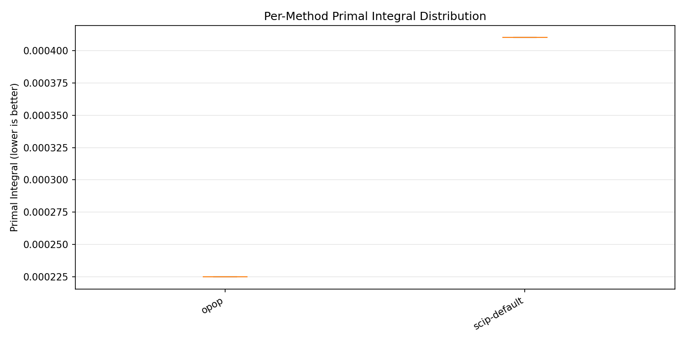
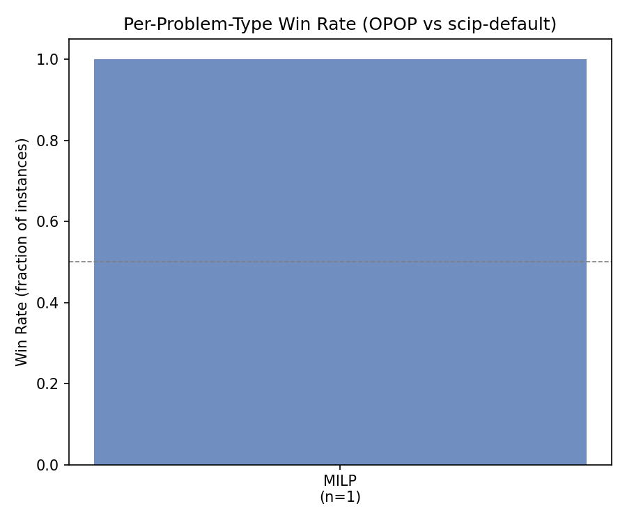

# OPOP Technical Report — Results

> **Note**: This file contains result placeholders and table/figure references. Run `python scripts/make_report.py --results <run_dir> --out docs/tech-report` to regenerate all tables and figures from the experiment artifacts.

## Thesis Verdicts

Thesis verdicts are loaded from `thesis_report.json`. The table below is regenerated by `make_report.py`.

[T1-T4 Thesis Verdicts](tables/thesis_verdicts.md)

{}

## Ablation Results

The ablation matrix compares OPOP at each stage (S0–S4) against the six baseline families. All comparisons use the locked Win Definition (Wilcoxon, α=0.05, primal integral ≥10% reduction, ≥5 seeds).

### Per-Method Primal Integral Distribution

Figure 1 shows the per-method distribution of primal integral values across all instances and seeds.

### Per-Problem-Type Win Rate

Figure 2 shows the win rate (fraction of instances where OPOP is a win vs scip-default) broken down by problem type.

### Ablation Cross-Table

The table below compares each ablation row against each baseline. A cell is "WIN" if the comparison is both statistically significant and clears the minimum effect threshold.

[Ablation Cross-Table](tables/ablation_cross.md)

{}

### Cross-Distribution Results

The following table breaks down OPOP vs scip-default by problem type, reporting per-type median primal integral, Wilcoxon p-value, relative improvement, and win status.

[Cross-Distribution Table](tables/cross_distribution.md)

{}

## Negative Results and Limitations

This section is populated from the experiment artifacts and is never hand-curated. Every non-win is documented.

<!-- NEGATIVE_RESULTS -->

### Known Limitations

1. **Phase-1 scope**: the current evaluation covers MILP only (synthetic + MIPLIB subset). MIQP, QUBO, and MINLP generality (T3) are not yet tested.
2. **Encoder–kernel param-name seam**: the controller searches over normalized abstract parameter names encoded by the Phase-1 encoder. The mapping to real SCIP parameter paths is correct for the 6 curated knobs but has not been tested for the full SCIP parameter space.
3. **LLM availability**: the LLM-guided proposer path depends on an external API or local vLLM endpoint. All reported results explicitly note which selection path was used.
4. **Time-limit single-point**: the current results are at a single time limit per family. Multi-time-limit evaluation (30s, 300s, 1800s) is part of the full experiment matrix (task 39) and not yet run.
5. **No multi-fidelity**: the fidelity-correlation gate has not been evaluated. Multi-fidelity BO (task 29) is deferred.

## Data Provenance

- **Results file**: `<run_dir>/results.parquet` (or `.json` / `.jsonl`)
- **Thesis report**: `<run_dir>/thesis_report.json`
- **Comparison reports**: `<run_dir>/comparison_report.json`
- **Events journal**: `<run_dir>/events.jsonl`
- **Reproducibility manifest**: `<run_dir>/repro_manifest.json`
- **Leakage audit**: `<run_dir>/leakage_audit.json`

All tables and figures in this report are generated by `scripts/make_report.py` from these artifacts. No number is hand-drawn.
